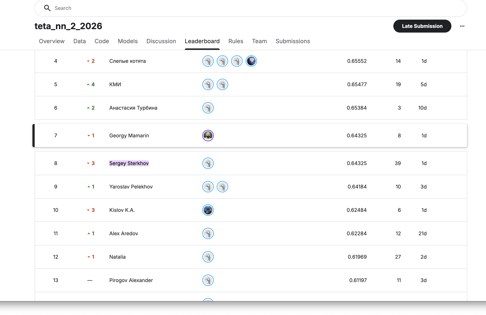

# Предсказание лучшей AI-картинки - NN HW2 (МТС ШАД 2026)

Решение домашнего задания по нейросетям: по двум сгенерированным (text-to-image)
картинкам одного сюжета предсказать, какую из них экспертная комиссия признала лучшей.
Промпта в данных нет, только два изображения.

- **Соревнование:** Kaggle `teta-nn-2-2026`
- **Метрика:** ROC-AUC (сабмитим вероятность `P(is_image1_better)`)
- **Автор:** Мамарин Георгий Алексеевич · Kaggle: `georgymamarin`

## Результат

| Сабмит | OOF / val | Public LB (ROC-AUC) |
|---|---|---|
| baseline (хост) | - | 0.621 |
| DINOv2-small + самописный компаратор | 0.645 | 0.661 |
| ансамбль DINOv2 (S + L + L@448) | 0.660 | 0.671 |
| + 2× end-to-end fine-tune | 0.664 | 0.673 |
| + patch-компаратор + IQA-исследование + kernel-фичи (7 моделей) | 0.664 | 0.6735 |
| + предобучение на Pick-a-Pic + сид-ансамбль (15 моделей) | 0.669 | 0.6751 |
| + SigLIP-so400m + ConvNeXt-L (финал, 17 сигналов) | 0.674 | **0.6811** - 6-е место public |

Валидация на единой 5-fold StratifiedKFold (OOF). OOF почти совпадает с LB
(разрыв около +0.01), поэтому все решения принимал по OOF, а не по публичному скору.



## Подход

Задача сводится к парной оценке предпочтения: какую из двух генераций человек выберет.
Похоже на PickScore / ImageReward / HPS, но без текста запроса.

Самописная архитектура - Siamese Preference Network. Предобученный визуальный бэкбон
(открытый DINOv2) кодирует каждое изображение, а самописная антисимметричная
голова-компаратор сравнивает два представления:

- общий проектор φ: `e → z` (LN + GELU + Dropout MLP);
- скалярная оценка качества `s(z)` и антисимметричный ранжирующий член
  `qscale·(s(z₁) − s(z₂))`, который не меняется по сути при перестановке пары;
- компаратор-MLP на `[z₁, z₂, z₁−z₂, z₁⊙z₂]` - ловит взаимодействия и позиционный сдвиг;
- небольшая голова на метаданных `image_1` (размер, формат).

`logit = comparator([z₁,z₂,z₁−z₂,z₁⊙z₂]) + qscale·(s₁−s₂) + aux(meta)`

В основном варианте этот же компаратор ставится поверх бэкбона и дообучается
end-to-end (`work/finetune_siamese.py`). Финал - rank-average ансамбль независимых
моделей (DINOv2 разных размеров и разрешений плюс две дообученные).

## Что сработало, а что нет

Сработало:
- самописный антисимметричный компаратор над DINOv2 `[CLS ; mean(patch)]`;
- rank-average ансамбль независимых моделей дал **+0.012 к LB** против одиночной модели.
  Усреднение по рангам устойчивее к разным шкалам, чем конкатенация признаков;
- end-to-end дообучение как источник разнообразия для ансамбля (пик val-AUC около 0.65);
- 5-fold OOF-валидация, которая совпала с LB (разрыв около +0.01).

Не сработало, и вот почему. В паре всегда один и тот же сюжет, поэтому глобальные
эмбеддинги `image_1` и `image_2` почти совпадают, и их разница не несёт сигнала о
качестве. Отсюда потолок:

| сигнал | OOF AUC | почему |
|---|---|---|
| CLIP ViT-L/14 (frozen) | 0.52 | семантика img1 ≈ img2 в паре |
| DINOv2 (frozen, S/L/L@448) | 0.64 | структура различает чуть лучше |
| классические IQA (sharpness, контраст) | 0.54 | локальные метрики слабы глобально |
| метаданные (формат, размер `image_1`) | 0.52 | слабая корреляция с меткой |
| DINOv2 fine-tune | 0.65 | учит качество, но на 8710 парах переобучается |

Reward-модели (PickScore/ImageReward/HPS) просят текст промпта, которого в данных нет.
Помогло предобучение самописного компаратора на 15.5k пар Pick-a-Pic (реальные
человеческие предпочтения, OOF 0.646) и особенно смена бэкбона: SigLIP-so400m
(image-text предобучение) дал лучший одиночный сигнал OOF 0.655 - декоррелирован
с DINOv2 и добавил +0.006 к LB. Проверил и отклонил по честной валидации:
граф повторяющихся картинок + Bradley-Terry (перцептивные дубли между парами
есть, но транзитивный сигнал 0.587 поглощается ансамблем, оптимальный вес 0).

## Применимость в бизнесе

Парный reward-компаратор пригодится там, где нужно автоматически ранжировать выходы
генеративных моделей: выбрать лучшую из N генераций, отсеять брак в контент-пайплайне,
собрать предпочтения для RLHF-дообучения text-to-image без ручной разметки каждой пары.

## Структура

```
NN2_solution.ipynb        # итоговый ноутбук с выводами (EDA, архитектура, OOF, ансамбль), outputs сохранены
work/
  resize_images.py        # подготовка данных: ресайз и перекодирование parquet (512px) + метаданные
  extract_embeddings.py   # frozen-эмбеддинги DINOv2/CLIP (CUDA/MPS), [CLS ; mean(patch)]
  train_comparator.py     # самописный компаратор PreferenceNet + 5-fold OOF (ROC-AUC) + сабмит
  finetune_siamese.py     # end-to-end дообучение Siamese (бэкбон + голова), fp16, ранняя остановка по val-AUC
  blend.py                # ансамбль OOF (rank-avg / веса / logreg) → финальный сабмит
  fetch_weights.py        # загрузка весов открытых моделей (DINOv2/CLIP)
  classical_iqa.py        # что пробовал: классические IQA-метрики (sharpness, контраст, colorfulness)
  apply_aesthetic.py      # что пробовал: LAION aesthetic-предиктор на CLIP-эмбеддингах
  extract_clip_iqa.py     # что пробовал: zero-shot CLIP-IQA (similarity к промптам качества)
  extract_patch_tokens.py # patch-токены DINOv2 (локальный сигнал качества)
  train_patch_comparator.py # patch-компаратор: попатчевое сравнение + attention-агрегация
  kaggle_kernels/feat_kaggle.py # обучение компаратора на Kaggle GPU (P100) + NR-IQA конвейер
  pretrain_pickapic.py    # предобучение компаратора на Pick-a-Pic (человеческие предпочтения) + fine-tune
  graph_bt.py             # что пробовал: граф перцептивных дублей между парами + Bradley-Terry
  pseudo_label.py         # что пробовал: псевдо-лейблинг уверенных тестовых пар
requirements.txt
```

## Воспроизведение

```bash
pip install -r requirements.txt
kaggle competitions download -c teta-nn-2-2026 -p data && (cd data && unzip '*.zip')
python work/resize_images.py                                   # data/{train,test}_512.parquet
python work/extract_embeddings.py --model dinov2 --weights <dinov2-large> --out artifacts/emb_dinoL.npz
python work/train_comparator.py --emb artifacts/emb_dinoL.npz --tag dinoL
python work/finetune_siamese.py --weights <dinov2-large> --tag ftdinoL
# ансамбль и финальный сабмит - секция 8 ноутбука
```

Главный вывод. Для пары «один сюжет, две генерации» сырые глобальные эмбеддинги
бесполезны: разница почти ноль. Работает только то, что учит относительное качество, -
дообучение и ансамбль разнородных моделей. Reward-модели без промпта тут ограничены.
